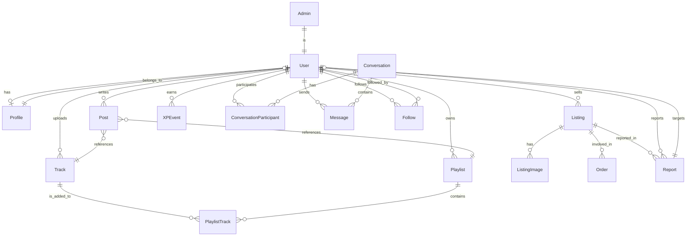

# Entity Relationship Diagram

```mermaid
erDiagram
  User ||--o| Profile : has
  User ||--o{ Post : writes
  User ||--o{ Track : uploads
  User ||--o{ Playlist : owns
  User ||--o{ Listing : sells
  User ||--o{ XPEvent : earns
  User ||--o{ ConversationParticipant : participates
  User ||--o{ Message : sends
  User ||--o{ Follow : follows
  User ||--o{ Follow : followed_by
  Profile ||--o| User : belongs_to
  Track ||--o{ PlaylistTrack : is_added_to
  Playlist ||--o{ PlaylistTrack : contains
  Post }o--|| Track : references
  Post }o--|| Playlist : references
  Listing ||--o{ ListingImage : has
  Listing ||--o{ Order : involved_in
  Conversation ||--o{ ConversationParticipant : has
  Conversation ||--o{ Message : contains
  Listing ||--o{ Report : reported_in
  User ||--o{ Report : reports
  Report ||--o| User : targets
  Admin ||--|| User : is
```